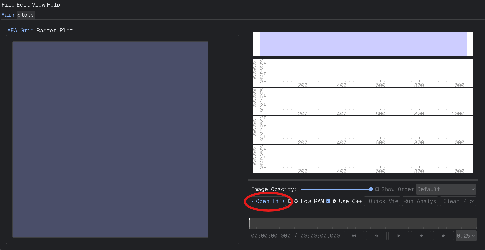
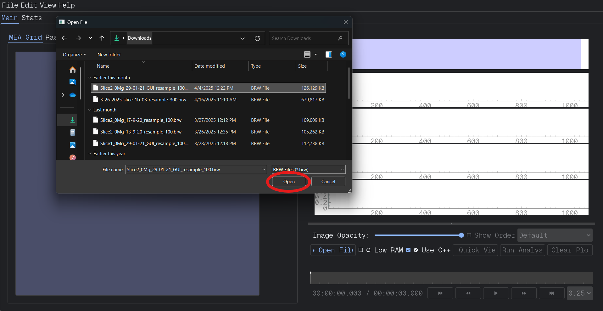
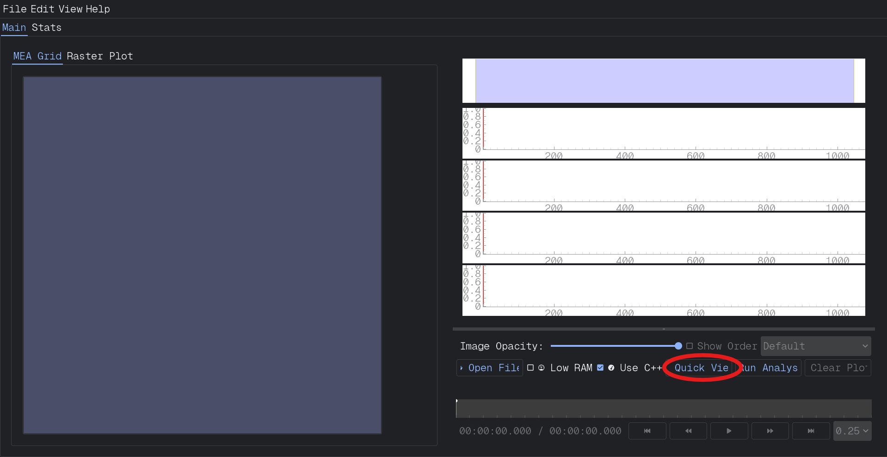
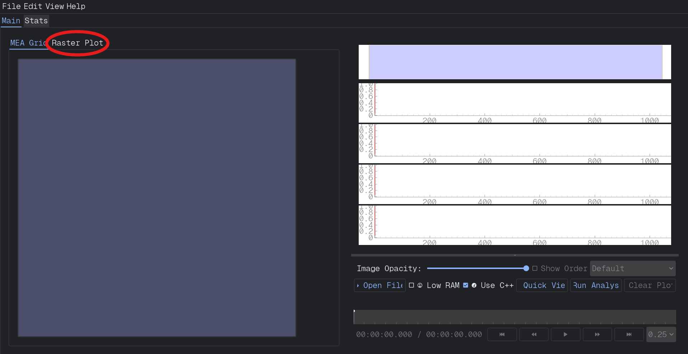
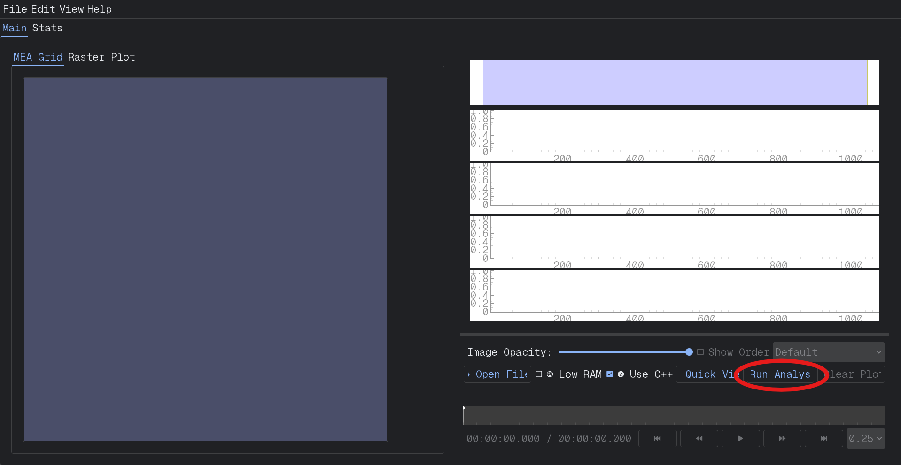

.. _walkthrough:

===========
Walkthrough
===========

The MEA GUI allows you to detect and quantify :term:`Seizure-Like Event (SLE)`s and other neural activity patterns from your processed :term:`Multi-Electrode Array (MEA)` recordings. This page walks you through the full workflow— from opening files to running analyses and viewing results.

Whether you're an experienced neuroscience researcher or an undergraduate research assistant, this step-by-step guide will help you understand and use the analysis tools effectively.

1. Open File
------------

Before analyzing data, load your MEA recording into the GUI.

Steps to Open a File:
~~~~~~~~~~~~~~~~~~~~~

1. Select the "Open File" button just below the graphs on the right-hand side of the screen. 

2. Browse to the ".brw" MEA file you want to open and click "Open".

4. Select the "Quick View" button to the right of the "Open File" button.

Once opened, a preview of the data will appear in the left-hand "MEA Grid" pane.

.. note::
  Files should be pre-processed using the GUI's processing tools or imported from compatible sources. Raw files without timestamps or signal alignment may not load properly.

2. Quick View
-------------

After opening your MEA file, you should **visually check your data** to ensure quality before running any analysis.

.. tip::
   It's a good practice to scan through the recording for any major noise or missing data before starting an analysis.

First, choose what you want to view...
~~~~~~~~~~~~~~~~~~~~~~~~~~~~~~~~~~~~~~

- **Raster Plots**: Select the ":term:`Raster Plot`" tab to display spike trains across electrodes.  
  (Use this to check for active electrodes and obvious artifacts.)

.. admonition:: Explore Raster Plots 📈

  Curious about how spikes are visualized across electrodes?  
  See the section on :ref:`Raster Plots <raster_plot>` for a deeper dive into interpreting activity on the MEA grid.

- **Location Field Potential (LFP) Traces**: Click any electrode on the MEA Grid to view its :term:`Local Field Potential (LFP)` trace over time. The LFP trace plot reflects slow voltage fluctuations from groups of neurons near the selected electrode, and it is helpful for spotting large discharges or seizure onset patterns.
  
  As a discharge propagates across the slice, the :ref:`false color map <_false_color_map>` on the MEA Grid dynamically updates to show which electrodes are active and when. Each square's color reflects the relative signal intensity at that electrode:
  
  - **Brighter or warmer colors** (e.g., red, yellow) represent stronger or more recent activity.
  - **Cooler colors** (e.g., blue) represent lower or older activity.
  - The map refreshes continuously to show real-time propagation across the brain slice.
  
  This visualization lets you **track how a discharge spreads** — from initiation, through propagation, to termination — as it recruits different regions.

  Once you've observed a discharge progressing across the array:
  
  1. **Watch the false color map closely** to identify where the discharge begins and how it travels.
  2. **Click the electrode** at the earliest point of activity — where the discharge likely originates.
  3. **Press the number key** `1` to save that LFP trace into Trace Box 1. (Denoted by a red shape in both the selected channel and its associated trace box.)
  4. Then, follow the discharge's path by selecting subsequent electrodes **along its propagation route**.
     - Press `2` and `3` to save intermediate points.
  5. Finally, identify where the discharge **appears to stop or weaken**, and save that electrode's trace to **Trace Box 4**.

  This process lets you reconstruct how the event evolved spatially across the slice.

  .. tip::
    By saving LFP traces from electrodes at key points along the path of the discharge, you can compare the waveform shape and timing across locations — helpful for understanding network recruitment and seizure spread.

  .. note::
    To learn more about navigating trace plots, saving multiple channels, and using the analysis views in more depth, see the :doc:`../layout/maintab/rightpane` documentation.

3. Configure Analysis Settings
------------------------------

Open the Analysis tab from the main tab bar.

Here you can set:

- :term:`Threshold detection` (in mV)

- Analysis :term:`Window size` (e.g., 10s, 30s, 60s)

- Event classification rules

Which electrodes to include (useful for excluding noisy ones)

Settings are pre-filled with default values suitable for common slice recordings.

.. note::
You can save and load custom configurations from the Configuration menu.

4. Run Analysis
---------------

After configuring, press the **Run Analysis** button at the bottom of the Analysis tab.

What Happens:

- The GUI extracts :term:`Spike` and :term:`Burst` data.

- It scans for :term:`Seizure-Like Event (SLE)`s.

- Results are visualized and saved in the results/ folder.

- Analysis usually takes 2-5 minutes per file, depending on its size.

.. tip::
Monitor progress in the status bar. You can cancel ongoing analysis with the Stop button if needed.

.. note::
  **Quick View vs. Run Analysis**

  - Use **Quick View** if you want to **watch live LFP traces** for each channel or **visualize activity** in real time on the false color map. This is ideal for quickly inspecting the recording without doing detailed analysis.

  - Use **Run Analysis** if you want to **detect seizures**, **track discharges**, and **generate quantitative results**. This runs the full analysis pipeline and saves structured results for further review.

5. View Results
---------------

Once complete, you'll see:

* SLE timeline: Start and end times of detected seizure-like events.

* Event list: Each event's duration, :term:`Amplitude`, and electrode involvement.

* Raster plots: With detected events highlighted.

Results are automatically saved and can be exported for further processing.

.. note::
  Use the Right Pane to switch between views (events, raster plots, statistics).

.. tip::
  Want to explore how a discharge spreads across the slice?

  After completing analysis, you can dive deeper using the :doc:`Discharge Propagation Tracking <dischargetracking>` tool to visualize spatial dynamics of seizure-like events.

Common Issues
~~~~~~~~~~~~~

* File won't open? Confirm it is processed and in ".brw" format.

* Analysis returns no events? Try lowering your :term:`Threshold detection` value.

* Too many false events? Consider raising your threshold or increasing the analysis :term:`Window size`.

Related Pages
~~~~~~~~~~~~~

- :doc:`./dischargetracking`

- :doc:`../layout/menubar`

- For definitions of ":term:`Discharge`", ":term:`Seizure-Like Event (SLE)`", ":term:`Artifact`", and more, visit the :doc:`../terminology` page.

.. toctree::
  :maxdepth: 1
  :hidden:

  ./dischargetracking.rst
