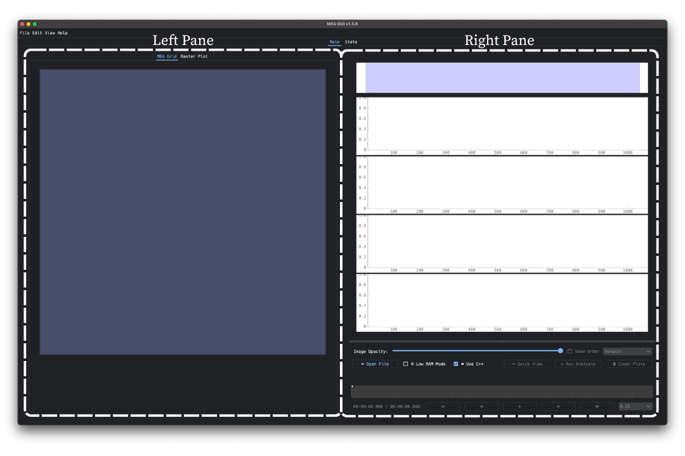
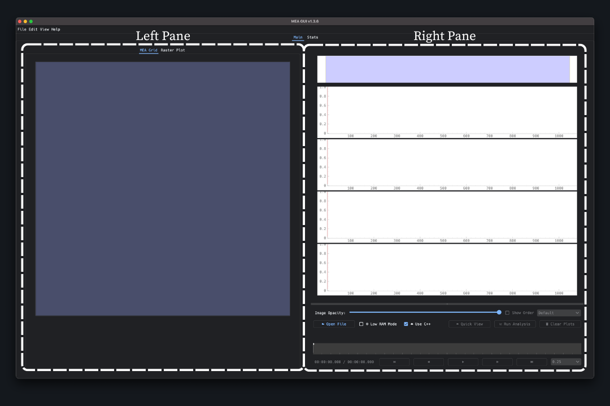

========
Main Tab
========

The **Main Tab** is the window that appears when you open the GUI, where most data interaction and analysis features are accessed. It is organized into two primary panes:

* The **Left Pane**, which contains two tab views: the ``MEA Grid`` for selecting electrodes, and the ``Raster Plot`` for reviewing spike activity.

* The **Right Pane**, which includes LFP trace plots in the top half, and the Control Panel in the bottom half for loading files, running analyses, and managing traces.

Each of these components works together to allow detailed inspection, grouping, and tracking of activity across the MEA.

For an introductory guide to running an analysis, start with the :ref:`Walkthrough <walkthrough>` section.

For more information about interacting with the Left or Right Pane, see:

* :doc:`Left Pane <leftpane>`

* :doc:`Right Pane <rightpane>`

.. toctree::
  :maxdepth: 1
  :hidden:

  leftpane
  rightpane